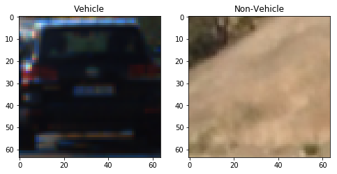
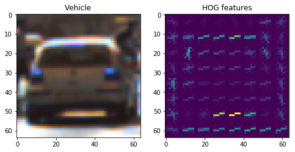
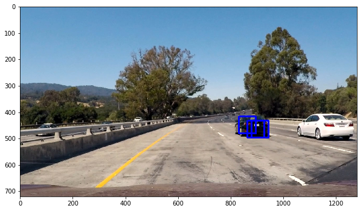
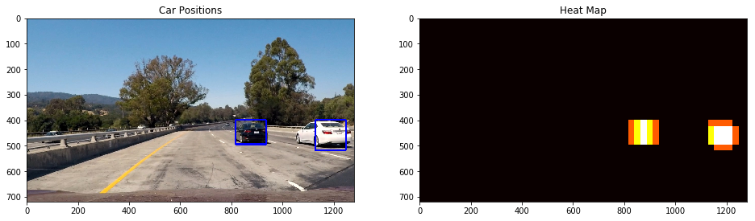

**Vehicle Detection Project**

The goal of this project is to detect vehicles on a video recorded from inside of a car. The detected cars has to be identified in the video by drawing boxes around them.

A pool of vehicle and non-vehicle images are provided by Udacity in order to be used as training and testing set to train a computer learning model to identify vehicles from non-vehicle images.

Here is a sample of vehicle and non-vehicle image in the pool.

# Steps in achieving the project goal

## 1- Extracting Histogram of Gradients (HOG) features of each frame

HOG features of each image/frame is extracted using `get_hog_features` method which is explained in the project lesson. However, later in the code, HOG features is extracted under the same method as for bin features and color histogram. I used variety of parameter values that are inputs to the `skimage.hog` function to find the best values by visualizing HOG features. I found that 9 orientations with 8 pixels per each cell and two cells per block (or 75% overlap) are the best values. Below is a sample of a HOG feature extraction on a sample image from the training data:

## 2- Resizing each frame to a 32x32 pixel image and extracting its features (bin features)

Bin features of each image/frame are extracted by `bin_spatial`method. The method is similar to what is used in the project lesson. This method, similar to HOG features, is moved under one method later in the code.

## 3- Extracting histogram of color of each frame

Color histogram for all color channels are extracted by `color_hist`method. The method is similar to what is used in the project lesson. This method, similar to HOG features, is moved under one method later in the code.

## 4- Training a Support Vector Machine (SVC) model on a database of vehicle and non-vehicle images

The `extract_features` method combines the last three steps in one method. It takes a list of images/frames as input with other user inputs (see the code) and returns a features list that contains sub-list of features of all the input images.

The dataset of images are split into training (80%) and test (20%) data set. All the features of these two data set are extracted and stored in two lists. After that two sets of labels are created, one per each training and test set. It should be noted that all the features of data sets are scaled and normalized around zero. Both training and test data set along with their corresponding labels are fed into a SVC model for training. The SVC model is used to predict existence of a car in an image in the next step.

## 5- Using Sliding Window method in order to scan each frame by multiple boxes and detect whether the box contains a car in it or not by using the trained model in step 4

The `find_cars` method is a sliding window that scans each image/frame and feed it into the SVC model that was trained in the last step. The SVC make the prediction. If it predeicts a car in a window, the method visualized the corresponding window by drawing a rectangle on its borders. The method outputs an image that has boxes or rectangles around the detected cars. This method is also similar to the method used in the project lesson. The required window sizes were found by testing variety of window scales (from 1.0 to 4.0) on `find_cars` method. It was found that the window scale parameter can be ranged from 1.0 to 3.0. These scales used in the video pipeline to scane each frame with multiple window sizes. The area of the search in each image in this project is limited to lower portion of the image where other cars appear.
Below is exmples of a processed image by this method for different sliding window sizes of 1.0, 1.5 and 2.5, respectively.

## 6. Creating a heatmap of the detected features in the image and applying a filter using a specific threshold in order to eliminate the False Positives detected by SVC model

It can be seen in the step 5 sample output image that multiple rectangles have been drawn on the image. All boxes on the same car have to be combined into one box. Also, there are cases that the model outputs Flase Positives which only appears in one frame and not the next frame. To solve this issue the heatmap method explained in the project lesson is used here.

The `add_heat` method creates a heatmap of the image with detected cars. Then low heat areas or False Positives get filtered out by `apply_threshold` method. After that, the `draw_labeled_bboxes` takes in the filtered heatmap and outputs an image with filtered false positives and only one box around the detected vehicles. Below is an example of an image processed by these methods:

## 7. Creating a pipeline to perform steps 1 thru 10, except step 4, on each frame of the video

The pipeline `car_position` performs all the above steps on each video frame. In addition to the steps, it scans each frame with multiple window sizes to detect cars at various distance. The function stores a list of the detected boxes in the last 5 frames and feed them into the steps in order to provide a car detection through the video. Please find the output video as `Project_Video_Output.mp4` in the project repository. 

Here is a link to the video:

[Output Video Link](https://github.com/ArmanKh9/P5_Vehicle_Detection/blob/master/project_video_processed.mp4)

## Discussion

The video pipeline works just fine without keeping a history of the detection or smoothing. However, adding the smoothing was a little bit challenging since keeping the previous boxes in a list causes many Flase Detection because the list saves the false detection as well. Hence, I decided to perform the heatmap and false positive filtering on each frame first and then store boxes from heatmap in a box list and then perform another heatmap detection. This way false positives were filtered before getting stored in the history list.

The pipeline draws one single box around two or multiple vehicles when they are close to each other.A method to count and track the number of detected cars in the frames can be useful to address this issue. This function can track number of the cars and label them and once two of them got too close, it knows that it needs to keep the bounding boxes split until the cars move away from each others again.

I think the smoothing will have a negative impact on the dection when a detected object suddenly moves. This is due to a history of detection that has been added to the model. Defining a method to track movement speed of the bounding boxes from frame to frame can be useful to address this issue. 

